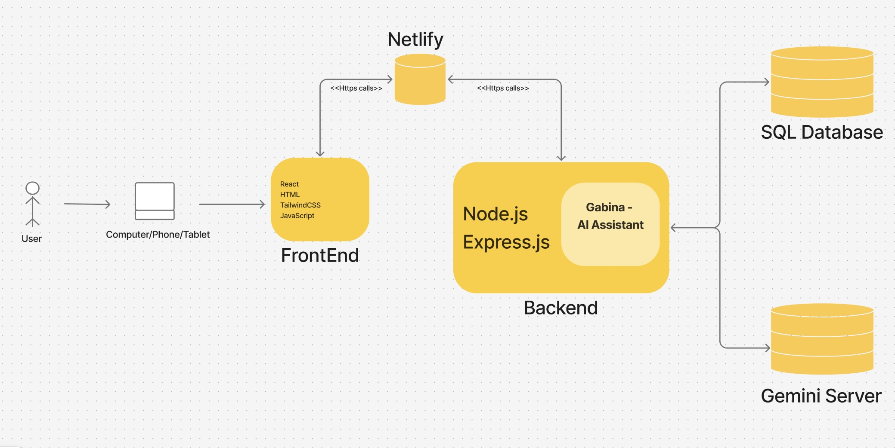

# Personal Portfolio Website with AI Chatbot 🤖🌐

A modern personal portfolio website integrated with an AI-powered chatbot that answers questions related to my **professional background, skills, and experience**.  
The chatbot is built using the **Gemini API** and maintains conversation history using a structured backend.

---

## 🚀 Features

- Interactive personal portfolio website
- AI-powered chatbot trained on my professional background
- Persistent conversation history with unique conversation IDs
- Secure API key handling
- Clean, modern UI with smooth animations
- Scalable backend architecture

---

## 🧠 Chatbot Capabilities

- Answers questions about:
   - Education
   - Skills & technologies
   - Projects
   - Work experience
   - Career interests
- Maintains conversation context using unique conversation IDs
- Stores chat history in a SQL database

---

## 🛠️ Tech Stack

### Frontend

- **React.js**
- **Tailwind CSS**
- **Framer Motion** (animations)
- **Lucide Icons**
- Responsive and accessible UI design

### Backend

- **Node.js**
- **Express.js**
- **ChatGPT API**
- **Zod** – validation & UUID generation
- **dotenv** – environment variable security
- **SQL Database** – conversation & message history

---

## 🏗️ System Architecture

The following diagram illustrates the overall system architecture of the application:

---

## 📁 Project Structure
